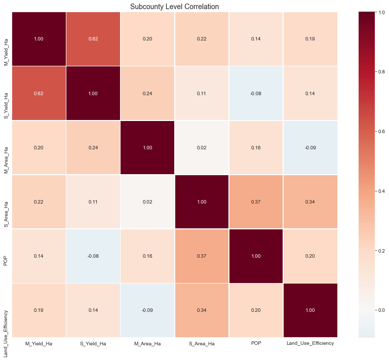
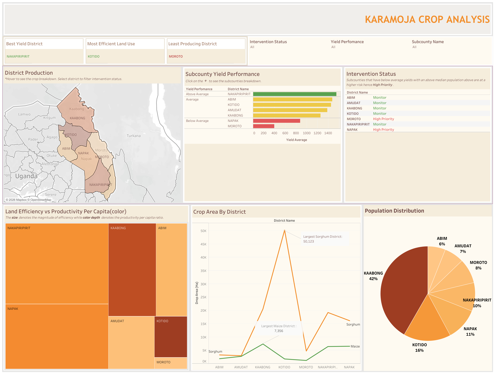

# Karamoja Agricultural Production Analysis


Karamoja is the most food-insecure region of Uganda. One of the main reasons is the low productivity of crops due to intense droughts as well as pest and disease outbreaks. 

To help NGOs provide technical support and prioritize interventions, this project presents a comprehensive data analysis of agricultural production in Karamoja, examining sorghum and maize yields across 7 districts and 52 subcounties to assess food security patterns and inform targeted interventions.


---

## Table of Contents

- [Project Overview](#project-overview)
- [Data Architecture](#data-architecture)
- [Data Understanding](#data-understanding)
- [Exploratory Data Analysis](#exploratory-data-analysis)
- [Key Findings](#key-findings)
- [Recommendations](#recommendations)
- [Technical Implementation](#technical-implementation)
- [Future Development](#future-development)

---

## Project Overview

This analysis investigates agricultural productivity in Karamoja, Uganda's most food-insecure region, using district and subcounty-level data. By examining relationships between population, land use, and crop yields, this project provides actionable insights for food security interventions.

### Core Business Questions

1. Which districts and subcounties have the highest and lowest agricultural productivity?
2. How do maize and sorghum yields compare across the region?
3. What is the relationship between population density and land use efficiency?
4. Which areas are most food secure based on per capita production?
5. Based on the above, what does the data inform

### Primary Stakeholders

| Stakeholder                     | Role                                  |
|---------------------------------|---------------------------------------|
| Uganda Ministry of Agriculture  | Policy development and resource allocation |
| Food Security NGOs              | Program targeting and intervention design |
| Local Government Officials      | District and subcounty planning       |
| Agricultural Extension Services | Field-level technical support         |

---

## Data Architecture

### Data Sources

- **Shapefiles**
  - District boundaries
  - Subcounty boundaries
  - Crop type maps

- **CSV Tables**
  - Production data
  - Population records
  - Agricultural metrics

### Dataset Structure

We have two tables of data in our dataset, categorized by the administration structure:

#### District Level (`district_df`)
```python
Shape: (7 rows, 11 columns)
Features: District name, population, area, crop yields, production totals

#### Subcounty Level (subcounty_df)

Shape: (52 rows, 13 columns)
Features: Subcounty name, district, population, yields, crop areas, production
```

## Data Understanding

####  1. Data Loading & Inspection
``` python
# Load shapefiles for spatial analysis
district_shp = read_shp("SHAPEFILES/Uganda_Districts.shp")
subcounty_shp = read_shp("SHAPEFILES/Uganda_Subcounties.shp")

# Load production data
district_df = pd.read_csv("TABLES/Uganda_Karamoja_District_Crop_Yield_Population.csv")
subcounty_df = pd.read_csv("TABLES/Uganda_Karamoja_Subcounty_Crop_Yield_Population.csv")
```

**Key Metrics:**
-  **7 Districts** with aggregated agricultural data
-  **52 Subcounties** with detailed production information  
-  **Maize & Sorghum** yield analysis
-  **Population dynamics** and land use efficiency

### 2. Feature Engineering
•	Calculated per capita production metrics to factor in the population in estimating food security levels.

•	Derived land use efficiency scores to establish which districts could be prioritized on agricultural support and training.

•	Aggregated district-level totals for maize and sorghum to determine the combined output.

### 3. Data Integration
Merged subcounty and district data to create a combined enriched master dataset:

python```
master_df = pd.merge(subcounty_df, district_df, 
                     left_on='DISTRICT_NAME', right_on='DNAME')
                     ```
### 4. Exploratory Data Analysis

### District Production Comparison


Kotido leads production at 18.6 million kg, while Moroto underperforms at 1 million kg, indicating significant regional disparities.

---

### Crop Yield Distributions


Maize yields show a positive distribution (1000–1200 kg/ha peak), while sorghum shows a negative distribution (100–300 kg/ha peak), indicating that maize is more established across the region.

---

### Correlation Analysis



Strong correlation between crop yields suggests shared environmental factors. Weak population–land use correlation indicates the need for agricultural education.

### Tableau Dashboard

This dataset was further visualized in Tableau for detailed interactive analysis.

**Link:**  
https://public.tableau.com/app/profile/mochama7964/viz/KaramojaCropAnalysis_17716932392280/KaramojaDashboard?publish=yes



## Key Findings

#### 1. Dramatic Production Disparities

Kotido district leads with 18.6 million kg in total production, while Moroto produces only 1 million kg, representing an 18-fold difference and signaling an urgent need for targeted support.

#### 2. Crop Performance Patterns

- Maize significantly outperforms sorghum, with average yields of 940 kg/ha versus 274 kg/ha.
- Maize shows strong, consistent production, with most subcounties achieving 1000–1200 kg/ha.
- Sorghum underperforms, with most subcounties producing only 100–300 kg/ha.
- These patterns confirm maize as the more established crop, while sorghum presents clear opportunities for improvement.

#### 3. Correlation Insights

- Strong correlation (0.48) between maize and sorghum yields
- Weak correlation (0.1) between population and land use efficiency
- Negligible relationship between maize and sorghum cultivation areas

---

## Recommendations

- Prioritize intensive agricultural interventions in Moroto district, which shows extreme underperformance.
- Implement sorghum improvement programs across all subcounties to address yield gaps.
- Expand agricultural training initiatives region-wide due to weak population–land use correlation.
- Establish ongoing per capita production monitoring to identify food-insecure subcounties.

---

## Technical Implementation

- Python for data processing and analysis
- Pandas and NumPy for data manipulation
- Shapefile for spatial analysis
- Matplotlib and Seaborn for visualization
- Tableau for dashboard development
- Jupyter Notebook for documentation and reproducibility
